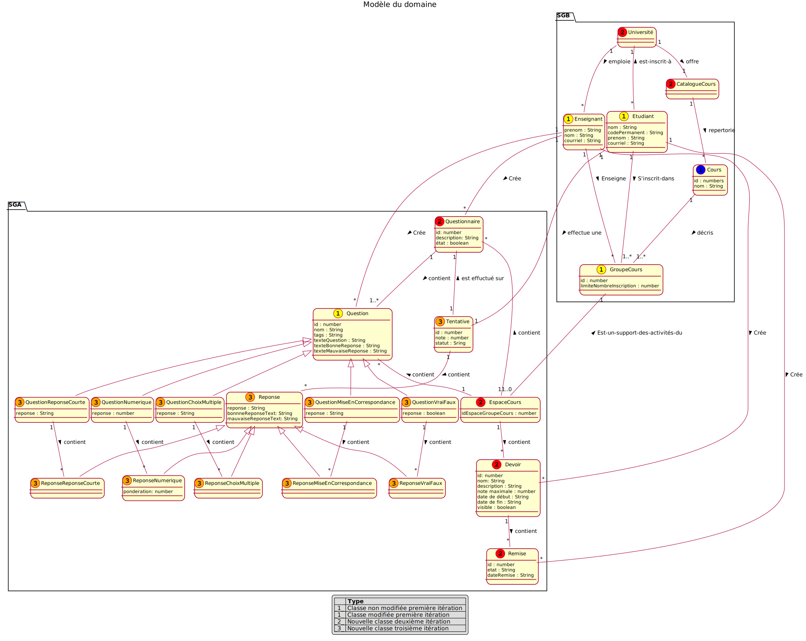

# Rapport itération 1 - équipe 3

## LOG210-année-session-groupe (ex. LOG210-2020-été-g01)

### Coéquipiers

- Bédard, Tommy, AQ13400
- Nom, Prénom, Code universel

### Chargés de laboratoire

- Valère K. Fami

# Grille de correction

CPliquez ici pour lire les consignes obligatoires

- Tous vos diagrammes doivent être faits avec <https://plantuml.com/fr/>
- Les diagrammes doivent être visibles dans ce rapport
- Supprimer les textes explicatifs du gabarit (sauf ces consignes-ci)
- Vous devez exporter ce fichier en format PDF et l'ajouter dans votre dépôt

> ⚠️ **Un travail qui contient trop d’erreurs fréquentes peut être refusé par le chargé de laboratoire. L'équipe peut reprendre le travail avec une pénalité de 25%. Vérifiez attentivement la grille de correction et les notes de cours**

Le travail sera noté selon la [grille de correction des rapports](https://docs.google.com/spreadsheets/d/1KKGPxac13vHttuC2AQDpRrgLuirMU0kd3qFxc9qhOuk). Pour y accéder, vous devez utiliser votre adresse `etsmtl.net`.

# Introduction

Dans cette première itération, l'objectif est de concevoir la structure générale d'un système de gestion des apprentissages, un modèle du domaine, des diagrammes de séquences systèmes reliés au cas d'utilisation ainsi que leur diagramme de cas d'utilisation. De plus, un objectif de cette itération est de réaliser l'implémentation des cas d'utilisations CU01 et CU02.

# Modèle du domaine

> Le MDD est cumulatif : vous devez y ajouter des éléments à chaque itération (ou corriger les erreurs), selon la portée (et votre meilleure compréhension du problème) visée par votre solution. Utilisez une légende dans le MDD pour indiquer la couleur de chaque itération afin de faire ressortir les changements. Voir les stéréotypes personnalisés : <https://plantuml.com/fr/class-diagram> et [comment faire une légende avec couleurs en PlantUML](https://stackoverflow.com/questions/30999290/how-to-generate-a-legend-with-colors-in-plantuml).

> 

## CU01a - Ajouter cours
**Acteur principal:**  Enseignant

**Préconditions:** 
- L’enseignant est authentifié. SGA transfère l'information à SGB pour l'authentification. SGB retourne un token que SGA retourne à l'usager. L'usager doit nécessairement utiliser ce token pour faire ses requêtes à SGA..

**Garanties en cas de succès (postconditions):**  
- Un nouveau cours est créé.
- L’enseignant est associé au cours
- Les étudiants inscrits dans le groupe-cours(SGB) sont associés au cours

**Scénario principal (succès):** 
1. L’enseignant demande de créer un nouveau cours.
1. Le système affiche la liste des groupes-cours qu’enseigne l’enseignant (l’information provient du SGB).
1. L’enseignant choisit un groupe-cours dans la liste.
1. Le système affiche l’information du cours et affiche la liste des étudiants inscrits dans le groupe-cours correspondant (l’information provient du SGB).

**Extensions (ou scénarios alternatifs):** 

&nbsp;&nbsp;&nbsp;3a. Un cours correspondant au groupe-cours sélectionné existe déjà.

&nbsp;&nbsp;&nbsp;&nbsp;&nbsp;&nbsp;1. Le système signale l'erreur et rejette la saisie.

## DSS CU01a - Ajouter espaceCours

### `recupererEspacesCoursSgb(token : String)`

> Si une opération a déjà été documentée dans un autre DSS, ajoutez un hyperlien vers le contrat précédent.

**Contrat d'opération**

_PostCondition_

  - aucun

**RDCU**

### `ajouterEspaceCours(tokenEnseignant : String, idEspaceCours : String)`

**Contrat d'opération**

_PostCondition_

- Un nouvel espaceCours est créé s'il n'existe pas déjà
- L’enseignant est associé au cours
- Les étudiants inscrits dans le groupe-cours(SGB) sont associés au cours

**RDCU**

## CU01b - Récupérer cours
**Acteur principal:**  Enseignant

**Préconditions:** 
- L’enseignant est authentifié.

**Garanties en cas de succès (postconditions):**  
- Aucun

**Scénario principal (succès):** 
1. L’enseignant demande la liste de ses cours.
1. Le système affiche la liste de ses cours.
1. L’enseignant demande les détails d’un cours.
1. Le système affiche l’information du cours et affiche la liste des étudiants inscrits.

## DSS CU01b - Récupérer espaceCours

### `recupererTousEspaceCours(token : String)` 

**Contrat d'opération**

_PostCondition_

- Aucun

**RDCU**

### `recupererUnEspaceCours(token : String, idCours : String)` ###

**Contrat d'opération**

_PostCondition_

- Aucun

**RDCU**

## CU01c - Retirer cours
**Acteur principal:**  Enseignant

**Préconditions:** 
- L’enseignant est authentifié.

**Garanties en cas de succès (postconditions):**  
- Le cours n’existe plus dans le système SGA

**Scénario principal (succès):** 
1. L’enseignant demande la liste de ses cours.
1. Le système affiche la liste de ses cours.
1. L’enseignant demande les détails d’un cours.
1. Le système affiche l’information du cours et affiche la liste des étudiants inscrits.
1. L’enseignant demande de supprimer le cours.
1. Le système demande une confirmation pour supprimer le cours.
1. L’enseignant confirme.
1. Le système supprime le cours et affiche la nouvelle liste de cours.
   
## DSS CU01c - Retirer cours

### `recupererTousEspaceCours(token : String)`
[recupererTousEspaceCours](#recuperertouscourssgatoken--string)

### `recupererUnEspaceCours(token : String, idEspaceCours : String)`
[recupererUnEspaceCours](#recupereruncourssgatoken--string-idcours--string)

### `supprimerEspaceCours(sigleCours : String, idEsapceCours: String)`

**Contrat d'opération**

_PostCondition_

- Le cours n’existe plus dans le système SGA

**RDCU**

Dans cette opération la partie de confirmation n'est pas illustrée, car celle-ci est gérée par le front end, dont les classes ne font pas partie du MDD.

## CU02a - Ajouter question
**Acteur principal:**  Enseignant

**Préconditions:** 
- L’enseignant est authentifié.

**Garanties en cas de succès (postconditions):**  
- Une nouvelle question a été créée dans la banque pour le cours.

**Scénario principal (succès):** 
1. L’enseignant commence la création de questions
1. Le système affiche les cours actifs de l’enseignant
1. L’enseignant sélectionne un cours
1. Le système affiche toutes les questions associées au cours.
1. L’enseignant ajoute une question de type vrai-faux en spécifiant une ou plusieurs catégories non hiérarchiques (“tags”), un nom (court) de la question, l’énoncé (le texte) de la question, la vérité (vrai ou faux) de l’énoncé, un texte de rétroaction pour la bonne réponse et un texte de rétroaction pour la mauvaise réponse.
1. L’enseignant répète l’étape 5 jusqu’à ce qu’il n’ait plus de questions à ajouter au cours.

**Extensions (ou scénarios alternatifs):** 

&nbsp;&nbsp;&nbsp;5a. L’enseignant ajoute un autre type de question (défini par S4)

&nbsp;&nbsp;&nbsp;5b. Le nom de la question n’est pas unique.

&nbsp;&nbsp;&nbsp;&nbsp;&nbsp;&nbsp;1. Le Système signale l'erreur et rejette la saisie.

## DSS CU02a - Ajouter question

### `recupererTousEspaceCours(token : String)`
[recupererTousEspaceCours](#recuperertouscourssgatoken--string)

### `recupererToutesQuestionsEspaceCours(idEspaceCours : int)`

**Contrat d'opération**

_PostCondition_

- aucune

**RDCU**

### `ajouterQuestion(tags : String[], nom : String, \ntexteQuestion : String, reponse : boolean,\ntexteBonneReponse : String, texteMauvaiseReponse : String)`

**Contrat d'opération**

_PostCondition_

- Une nouvelle question a été créée dans la banque pour le cours.

**RDCU**

## CU02b - Récupérer question
**Acteur principal:**  Enseignant

**Préconditions:** 
- L’enseignant est authentifié.

**Garanties en cas de succès (postconditions):**  
- Aucun

**Scénario principal (succès):** 
1. L’enseignant commence la récupération de questions
1. Le système affiche toutes les questions de l’enseignant
1. L’enseignant sélectionne une question
1. Le système affiche les détails de la question
   
On répète les étapes 3 et 4 tant que l’enseignant n’a pas terminé

## DSS CU02b - Récupérer question

### `recupererToutesQuestionsSga(token : String)`

**Contrat d'opération**

_PostCondition_

- aucune

**RDCU**

### `recupererUneQuestion(token : String, idQuestion : String)`

**Contrat d'opération**

_PostCondition_

- aucune

**RDCU**

## CU02c - Modifier question
**Acteur principal:**  Enseignant

**Préconditions:** 
- L’enseignant est authentifié.

**Garanties en cas de succès (postconditions):**  
- La question a été modifiée dans la banque pour le cours.

**Scénario principal (succès):** 
1. L’enseignant commence la modification d’une question
1. Le système affiche les valeurs actuelles de la question à modifier.
1. L’enseignant effectue les modifications de la question et les sauvegarde.
1. Le système affiche la question modifiée.

**Extensions (ou scénarios alternatifs):** 

&nbsp;&nbsp;&nbsp;3a. Le nom (modifié) de la question n’est pas unique.

&nbsp;&nbsp;&nbsp;&nbsp;&nbsp;&nbsp;1. Le Système signale l'erreur et rejette la saisie.

## DSS CU02c - Modifier question

### `recupererUneQuestion(idEspaceCours : int, idQuestion : int)`
[recupererUneQuestion](#recupererunequestiontoken--string-idquestion--string)

### `modifierQuestion(tags : String[], nom : String, texteQuestion : String, reponse : boolean,texteBonneReponse : String, texteMauvaiseReponse : String)`

**Contrat d'opération**

_PostCondition_

  - La question a été modifiée dans la banque pour le cours.

**RDCU**

## CU02d - Supprimer question
**Acteur principal:**  Enseignant

**Préconditions:** 
- L’enseignant est authentifié.

**Garanties en cas de succès (postconditions):**  
- Une question a été supprimée de la banque pour le cours.

**Scénario principal (succès):** 
1. L’enseignant commence la suppression d’une question
1. Le système affiche les valeurs actuelles de la question à supprimer.
1. L’enseignant confirme la suppression de la question

**Extensions (ou scénarios alternatifs):**

&nbsp;&nbsp;&nbsp;2a. Le système affiche la liste des questionnaires utilisant cette question et désactive la possibilité de suppression tant que la question est utilisée dans un questionnaire.

## DSS CU02d - Supprimer question

### `recupererUneQuestion(idEspaceCours : int, idQuestion : int)`
[recupererUneQuestion](#recupererunequestiontoken--string-idquestion--string)

### `supprimerUneQuestion(idQuestion : String)`

**Contrat d'opération**

_PostCondition_

- Une question a été supprimée de la banque pour le cours.

**RDCU**

## CU04a - Ajouter devoir
**Acteur principal:**  Enseignant

**Préconditions:** 
- L’enseignant est authentifié.

**Garanties en cas de succès (postconditions):**  
- Un nouveau devoir est créé et associé à un cours

**Scénario principal (succès):** 
1. L’enseignant commence la création d’un devoir
1. Le système affiche les cours de l’enseignant ainsi que le nombre de devoirs associés à chaque cours
1. L’enseignant sélectionne un cours
1. Le système affiche tous les devoirs associés au cours.
1. L’enseignant crée un nouveau devoir avec une description et un nom, une note maximale, une date de début, une date de fin et un état visible ou non.  
1. Le système confirme l’ajout du devoir et affiche tous les devoirs associés au cours.

On répète les étapes 5-6 tant qu’il y a un devoir à ajouter

**Extensions (ou scénarios alternatifs):**

&nbsp;&nbsp;&nbsp;5a. La date de début est après la date de fin.

&nbsp;&nbsp;&nbsp;&nbsp;&nbsp;&nbsp;1. Le Système signale l'erreur et rejette la saisie.

## DSS CU04a - Ajouter devoir

### `recupererTousEspaceCours(token : String)`
[recupererTousEspaceCours](#recuperertousespacecourstoken--string)

### `recupererTousDevoirsEspaceCours(idEspaceCours : int)`

**Contrat d'opération**

_PostCondition_

- Aucune.

**RDCU**

### `ajouterDevoir(nom: string, description: string, noteMaximale: number, dateDebut: String, dateFin: String, visible: boolean)`

**Contrat d'opération**

_PostCondition_

- Un nouveau devoir est créé
- Les attributs du devoir ont été initialisés
- Le nouveau devoir est associé à un espaceCours sur la base de idEspaceCours

**RDCU**

