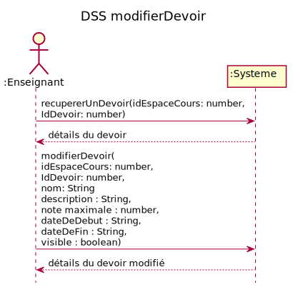
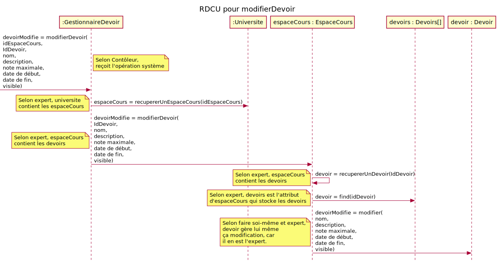
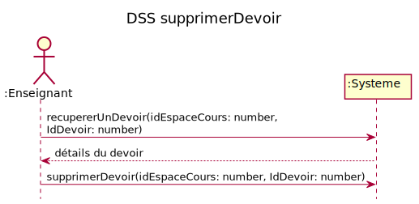
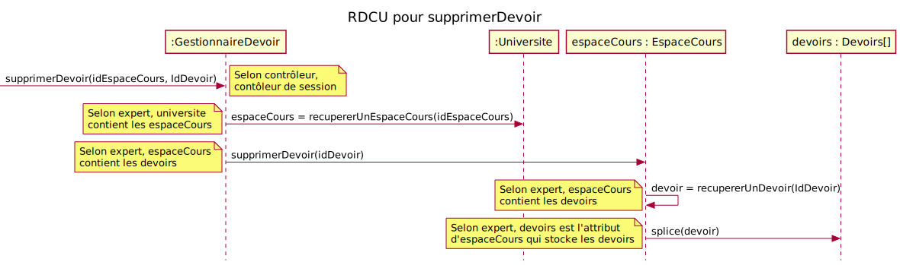
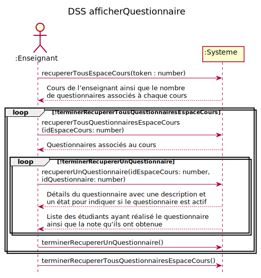
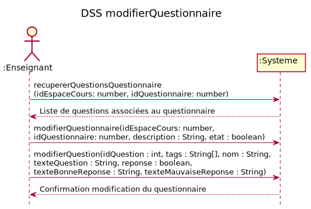
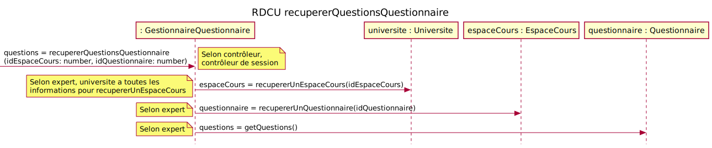
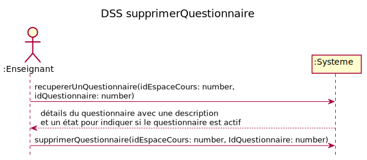
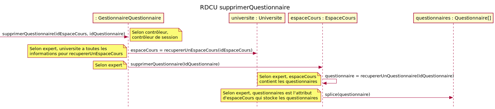

# Rapport itération 2 - équipe 3

## LOG210-2021-été-g01

### Coéquipiers

- Bédard, Tommy, AQ13400
- Nom, Prénom, Code universel

### Chargés de laboratoire

- Valère K. Fami

# Grille de correction

Cliquez ici pour lire les consignes obligatoires

- Tous vos diagrammes doivent être faits avec <https://plantuml.com/fr/>
- Les diagrammes doivent être visibles dans ce rapport
- Supprimer les textes explicatifs du gabarit (sauf ces consignes-ci)
- Vous devez exporter ce fichier en format PDF et l'ajouter dans votre dépôt

# Introduction
<!-- TO DO -->

# Modèle du domaine
> 

## CU04a - Ajouter devoir
**Acteur principal:**  Enseignant

**Préconditions:** 
- L’enseignant est authentifié.

**Garanties en cas de succès (postconditions):**  
- Un nouveau devoir est créé et associé à un cours

**Scénario principal (succès):** 
1. L’enseignant commence la création d’un devoir
1. Le système affiche les cours de l’enseignant ainsi que le nombre de devoirs associés à chaque cours
1. L’enseignant sélectionne un cours
1. Le système affiche tous les devoirs associés au cours.
1. L’enseignant crée un nouveau devoir avec une description et un nom, une note maximale, une date de début, une date de fin et un état visible ou non.  
1. Le système confirme l’ajout du devoir et affiche tous les devoirs associés au cours.

On répète les étapes 5-6 tant qu’il y a un devoir à ajouter

**Extensions (ou scénarios alternatifs):**

&nbsp;&nbsp;&nbsp;5a. La date de début est après la date de fin.

&nbsp;&nbsp;&nbsp;&nbsp;&nbsp;&nbsp;1. Le Système signale l'erreur et rejette la saisie.

## DSS CU04a - Ajouter devoir

### `recupererTousEspaceCours(token : String)` 

**Contrat d'opération**

_PostCondition_

- Aucun

**RDCU**

### `recupererTousDevoirsEspaceCours(idEspaceCours : number)`

**Contrat d'opération**

_PostCondition_

- Aucune.

**RDCU**

### `ajouterDevoir(nom: string, description: string, noteMaximale: number, dateDebut: String, dateFin: String, visible: boolean)`

**Contrat d'opération**

_PostCondition_

- Un nouveau devoir d a été créé
- Les attributs de d ont été initialisés
- d a été associé à un espaceCours sur la base de idEspaceCours

**RDCU**

## CU04b - Récupérer devoir
**Acteur principal:**  Enseignant

**Préconditions:** 
- L’enseignant est authentifié.

**Garanties en cas de succès (postconditions):**  
- Aucune

**Scénario principal (succès):** 
1. L’enseignant commence la récupération d’un devoir
1. Le système affiche les cours de l’enseignant ainsi que le nombre de devoirs associés à chaque cours
1. L’enseignant sélectionne un cours
1. Le système affiche tous les devoirs associés au cours.
1. L’enseignant sélectionne un devoir
1. Le système affiche le détail du devoir
1. Le système affiche la liste des étudiants ayant fait le devoir ainsi que la note leur étant associée. 

On répète les étapes 5 à 7 tant que l’enseignant n’a pas terminé.

On répète les étapes 3 à 7 tant que l’enseignant n’a pas terminé.

**Extensions (ou scénarios alternatifs):**

&nbsp;&nbsp;&nbsp;7a. Le système affiche les étudiants par ordre alphabétique.

&nbsp;&nbsp;&nbsp;7b. Le système affiche les étudiants par ordre croissant de la note.

## DSS CU04b - Récupérer devoir

### `recupererTousEspaceCours(token : String)` 
[recupererTousEspaceCours](#recuperertousespacecourstoken--string)

### `recupererTousDevoirsEspaceCours(idEspaceCours : number)`
[recupererTousDevoirsEspaceCours](#recuperertousdevoirsespacecoursidespacecours--number)

### `recupererUnDevoir(idEspaceCours: number, IdDevoir: number)`

**Contrat d'opération**

_PostCondition_

- Aucune.

**RDCU**

## CU04c - Modifier devoir
**Acteur principal:**  Enseignant

**Préconditions:** 
- L’enseignant est authentifié.

**Garanties en cas de succès (postconditions):**  
- Un devoir est modifié

**Scénario principal (succès):** 
1. L’enseignant commence la modification d’un devoir
1. Le système affiche les valeurs actuelles du devoir à modifier.
1. L’enseignant effectue les modifications du devoir et les sauvegarde.
1. Le système affiche tout le devoir modifié

**Extensions (ou scénarios alternatifs):**

&nbsp;&nbsp;&nbsp;1a. Un devoir ne peut pas être modifié si des étudiants ont déjà commencé à réaliser celui-ci.

## DSS CU04c - Modifier devoir

### `recupererUnDevoir(idEspaceCours: number, IdDevoir: number)`
[RécupérerUnDevoir](#recupererundevoiridespacecours-number-iddevoir-number)

### `modifierDevoir(idEspaceCours: number, IdDevoir: number)`

**Contrat d'opération**

_PostCondition_

- Les attributs du devoir d ont été modifié

**RDCU**

## CU04d - Supprimer devoir
**Acteur principal:**  Enseignant

**Préconditions:** 
- L’enseignant est authentifié.

**Garanties en cas de succès (postconditions):**  
- Un devoir a été supprimé pour le cours.

**Scénario principal (succès):** 
1. L’enseignant commence la suppression d’un devoir
1. Le système affiche les valeurs du devoir à supprimer.
1. L’enseignant confirme la suppression du devoir

**Extensions (ou scénarios alternatifs):**

&nbsp;&nbsp;&nbsp;2a. Le système désactive la possibilité de suppression tant que le devoir a été utilisé par des étudiants.

## DSS CU04d - Supprimer devoir

### `recupererUnDevoir(idEspaceCours: number, IdDevoir: number)`
[RécupérerUnDevoir](#recupererundevoiridespacecours-number-iddevoir-number)

### `supprimerDevoir(idEspaceCours: number, IdDevoir: number)`

**Contrat d'opération**

_PostCondition_

- L'instance d de Devoir a été supprimée

**RDCU**

## CU05a - Ajouter questionnaire
**Acteur principal:**  Enseignant

**Préconditions:** 
- L’enseignant est authentifié.

**Garanties en cas de succès (postconditions):**  
- Un nouveau questionnaire a été créé et associé à un cours
- Des questions ont étés associées au questionnaire

**Scénario principal (succès):** 
1. L’enseignant commence la création d’un questionnaire
1. Le système affiche les cours de l’enseignant ainsi que le nombre de questionnaires associés à chaque cours
1. L’enseignant sélectionne un cours
1. Le système affiche tous les questionnaires associés au cours.
1. L’enseignant crée un nouveau questionnaire avec une description et un état pour indiquer si le questionnaire est actif
1. Le système confirme la création du questionnaire
1. Le système affiche la liste de catégories de questions
1. L’enseignant sélectionne la catégorie de question
1. Le système affiche les questions correspondant à la catégorie ainsi que le nombre de questionnaires auxquels ces questions ont déjà été ajoutées.
1. L’enseignant sélectionne une ou plusieurs questions et les ajoute au questionnaire.

On répète les étapes 7-10 tant que l’enseignant n’a pas terminé l’ajout de questions.

**Extensions (ou scénarios alternatifs):** 

## DSS CU05a - Ajouter questionnaire

### `recupererTousEspaceCours(token : String)` 
[recupererTousEspaceCours](#recuperertousespacecourstoken--string)

### `recupererTousQuestionnairesEspaceCours(idEspaceCours: number)`

**Contrat d'opération**

_PostCondition_

- Aucune

**RDCU**

### `creerQuestionnaire(idEspaceCours:number, description : String, etat : boolean)`

**Contrat d'opération**

_PostCondition_

- Une nouvelle instance newQuestionnaire de Questionnaire a été créee
- Les attributs de newQuestionnaire ont été initialisés
- newQuestionnaire a été associée à son espaceCours sur la base de correspondance de idEspaceCours

**RDCU**

### `recupererQuestionParTag(idEspaceCours: number,tag : string)`

**Contrat d'opération**

_PostCondition_

- Aucune

**RDCU**

### `gererQuestionsQuestionnaire(idQuestionnaire : number, idEspaceCours: number, arrayIdQuestionsAjouter: string`

**Contrat d'opération**

_PostCondition_

- Les questions basé sur une correspondance avec idQuestionsAjouter ont été associées au questionnaire sur une bsae de correspondance avec idQuestionnaire

**RDCU**

## CU05b - Afficher questionnaire
**Acteur principal:**  Enseignant

**Préconditions:** 
- L’enseignant est authentifié.
- Il existe un cours, un questionnaire, etc.

**Garanties en cas de succès (postconditions):**  
- Aucune

**Scénario principal (succès):** 
1. L’enseignant commence la gestion des questionnaires
1. Le système affiche les cours de l’enseignant ainsi que le nombre de questionnaires associés à chaque cours
1. L’enseignant sélectionne un cours
1. Le système affiche tous les questionnaires associés au cours.
1. L’enseignant sélectionne un questionnaire
1. Le système affiche les détails du questionnaire avec une description et un état pour indiquer si le questionnaire est actif
1. Le système affiche la liste des étudiants ayant réalisé le questionnaire ainsi que la note qu’ils ont obtenue.

On répète les étapes 5 à 7 tant que l’enseignant n’a pas terminé.

On répète les étapes 3 à 7 tant que l’enseignant n’a pas terminé.

## DSS CU05b - Afficher questionnaire

### `recupererTousEspaceCours(token : String)` 
[recupererTousEspaceCours](#recuperertousespacecourstoken--string)

### `recupererTousQuestionnairesEspaceCours(idEspaceCours: number)`
[recupererTousQuestionnairesEspaceCours](#recuperertousquestionnairesespacecoursidespacecours-number)

### `recupererUnQuestionnaire(idEspaceCours: number, idQuestionnaire: number)`

**Contrat d'opération**

_PostCondition_

- Aucune

**RDCU**

Ici pour se qui est de l'affichage des détails du questionnaire, il suffit de récupérer les attributs du questionnaires. Pour la liste d'étudiants il faut récupérer la remise et ensuite récupérer les détails des étudiants. Ces opérations ne sont pas démontrées dans le RDCU car cela ce passe dans le "front-end".

## CU05c - Modifier questionnaire
**Acteur principal:**  Enseignant

**Préconditions:** 
- L’enseignant est authentifié.
- Il existe un cours, un questionnaire, etc.

**Garanties en cas de succès (postconditions):**  
- Un questionnaire a été modifié
- Les questions associées au questionnaire ont été modifiées

**Scénario principal (succès):** 
1. L’enseignant commence la modification d’un questionnaire
1. Le système affiche la liste de questions associées au questionnaire
1. L’enseignant modifie la description et/ou l’état du questionnaire
1. L’enseignant modifie les questions associées au questionnaire
1. Le système confirme la modification du questionnaire

**Extensions (ou scénarios alternatifs):**

&nbsp;&nbsp;&nbsp;3a. 4a. L’enseignant ajoute une question au questionnaire.

&nbsp;&nbsp;&nbsp;4b. L’enseignant supprime une question du questionnaire.

## DSS CU05c - Modifier questionnaire

### `recupererQuestionsQuestionnaire(idEspaceCours: number, idQuestionnaire: number)`

**Contrat d'opération**

_PostCondition_
- Aucune

**RDCU**

### `modifierQuestionnaire(idEspaceCours: number,idQuestionnaire: number, description : String, etat : boolean)`

**Contrat d'opération**

_PostCondition_
- Les attributs du Questionnaire "questionnaire" ont été modifiés

**RDCU**

### `modifierQuestion(tags : String[], nom : String, texteQuestion : String, reponse : boolean,texteBonneReponse : String, texteMauvaiseReponse : String)`

**Contrat d'opération**

_PostCondition_

  - Les attributs de la Question "question" ont été modifiés

**RDCU**

## CU05d - Supprimer questionnaire
**Acteur principal:**  Enseignant

**Préconditions:** 
- L’enseignant est authentifié.
- Il existe un cours, un questionnaire, etc.

**Garanties en cas de succès (postconditions):**  
- Un questionnaire associé à un cours est supprimé

**Scénario principal (succès):** 
1. L’enseignant commence la suppression d’un questionnaire
1. Le système affiche les détails du questionnaire avec une description et un état pour indiquer si le questionnaire est actif
1. L’enseignant supprime le questionnaire

**Extensions (ou scénarios alternatifs):**

&nbsp;&nbsp;&nbsp;1a. Le système désactive la possibilité de suppression du questionnaire aussitôt qu’un étudiant à réalisé celui-ci dans le cadre du cours.

## DSS CU05d - Supprimer questionnaire

### `recupererUnQuestionnaire(idEspaceCours: number, idQuestionnaire: number)` 
[recupererUnQuestionnaire](#recupererunquestionnaireidespacecours-number-idquestionnaire-number)

### `supprimerQuestionnaire(idEspaceCours: number, IdQuestionnaire: number)`

**Contrat d'opération**

_PostCondition_
- Un Questionnaire "questionnaire" a été supprimé sur une base de correspondance avec idQuestionnaire

**RDCU**

