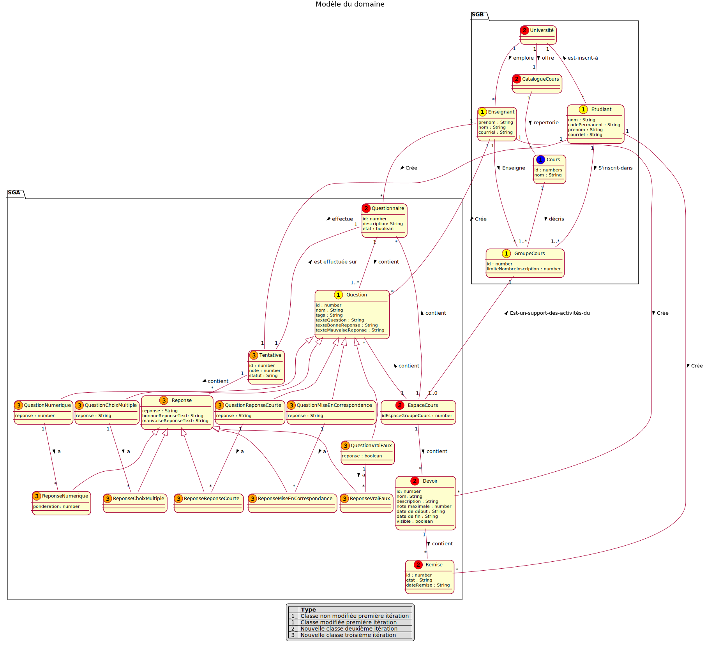

# Rapport itération 2 - équipe 3

## LOG210-2021-été-g01

### Coéquipiers

- Bédard, Tommy, AQ13400
- Abdelli, Pierre Amar, AQ48850
- Bewa, Lionel, AQ22600
- El-Safady, Sobhi, AP94320
- Korchi, Zakaria, AQ25210

### Chargés de laboratoire

- Valère K. Fami

# Grille de correction

Cliquez ici pour lire les consignes obligatoires

- Tous vos diagrammes doivent être faits avec <https://plantuml.com/fr/>
- Les diagrammes doivent être visibles dans ce rapport
- Supprimer les textes explicatifs du gabarit (sauf ces consignes-ci)
- Vous devez exporter ce fichier en format PDF et l'ajouter dans votre dépôt

# Introduction
L'objectif général de ce projet est de concevoir un système de gestion des apprentissages. Dans cette itération, les cas d'utilisations CU04 (a,b,c,d) ainsi que CU05 (a,b,c,d) ont été implémentés, testés et documentés. Ces cas correspondent à la gestion des devoirs ainsi que des questionnaires. Cette itération inclut notamment l'ajout de ces fonctionnalités, l'ajout de tests, l'incrémentation du MDD, l'ajout de DSS pour chaque cas d'utilisation ainsi que l'ajout de RDCU pour chacune des opérations système.

# Modèle du domaine
> 

## CU07 - Passer questionnaire
**Acteur principal:**  Étudiant

**Préconditions:** 
- L’étudiant est authentifié.

**Garanties en cas de succès (postconditions):**  
- Une association entre l’étudiant et le questionnaire a été créée
- Le résultat est sauvegardé dans le système de gestion des bordereaux

**Scénario principal (succès):** 
1. L’étudiant sélectionne un cours parmi les cours auxquels il est inscrit
1. Le système affiche les questionnaires déjà complétés avec les notes reçues.
1. Le système affiche les questionnaires à compléter
1. L’étudiant sélectionne un questionnaire à compléter
1. Le système affiche une question
1. L’étudiant répond à la question
1. On répète les étapes 5-6 tant que toutes les questions n’ont pas été complétées.
1. Le système affiche la note obtenue et le texte de rétroaction (bonne ou mauvaise réponse) pour chaque question ainsi que la note résultante en pourcentage
1. On répète les étapes 2 à 8 tant que l’étudiant n’a pas terminé.

**Extensions (ou scénarios alternatifs):** 

## DSS CU07 - Passer questionnaire

### `recupererTousQuestionnairesEspaceCours(idEspaceCours: number)` 

**Contrat d'opération**

_PostCondition_

- Aucune

**RDCU**

### `recupererQuestionsQuestionnaire(idEspaceCours: number,idQuestionnaire: number)` 

**Contrat d'opération**

_PostCondition_

- Aucune

**RDCU**

### `ajouterReponseTentative(idEspaceCours : number,idQuestionnaire : number, reponse : String)` 

**Contrat d'opération**

_PostCondition_

- Une instance "i" de Tentantive a été créée
- les attributs de "i" ont été initialisée
- "i" a été liée à un Questionnaire sur la base de correspondance avec idQuestionnaire

**RDCU**

### `terminerAjouterReponseTentative(idEspaceCours : number,\nidQuestionnaire : number)` 

**Contrat d'opération**

_PostCondition_

- l'attribut statut de "i" a été modifié a corrigé
- l'attribut resultat de "i" a été modifié pour la note de l'élève

**RDCU**

