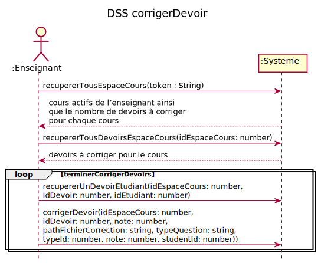
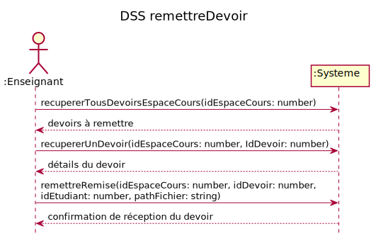
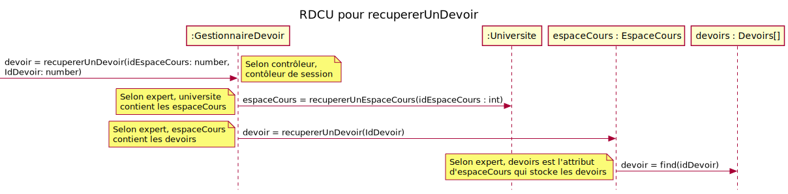

# Rapport itération 2 - équipe 3

## LOG210-2021-été-g01

### Coéquipiers

- Bédard, Tommy, AQ13400
- Abdelli, Pierre Amar, AQ48850
- Bewa, Lionel, AQ22600
- El-Safady, Sobhi, AP94320
- Korchi, Zakaria, AQ25210

### Chargés de laboratoire

- Valère K. Fami

# Grille de correction

Cliquez ici pour lire les consignes obligatoires

- Tous vos diagrammes doivent être faits avec <https://plantuml.com/fr/>
- Les diagrammes doivent être visibles dans ce rapport
- Supprimer les textes explicatifs du gabarit (sauf ces consignes-ci)
- Vous devez exporter ce fichier en format PDF et l'ajouter dans votre dépôt

# Introduction
L'objectif général de ce projet est de concevoir un système de gestion des apprentissages. Dans cette itération, CU02 - gérer questions a été modifier afin d'ajouter le support pour divers types de questions. De plus les cas : CU03, CU06, CU07, ainsi que CU05 (a,b,c,d) ont été implémentés incluant les scénarios alternatifs, testés et documentés. Ces cas correspondent à la correction et la remise des devoirs ainsi que le passage des questionnaires. Cette itération inclut notamment l'ajout de ces fonctionnalités, l'ajout de tests, l'incrémentation du MDD, l'ajout de DSS pour chaque cas d'utilisation ainsi que l'ajout de RDCU pour chacune des opérations système. Finalement, certaine mesure mesure FURPS+ ont été instaurés notamment : F1, F2, U1, R1, S3.

# Modèle du domaine
> 

## CU03 - Corriger devoir
**Acteur principal:**  Enseignant

**Préconditions:** 
- L’enseignant est authentifié.

**Garanties en cas de succès (postconditions):**  
- Les devoirs associés au cours ont été corrigés
-  Les notes des devoirs ont été transmises au système de gestion des bordereaux (SGB).

**Scénario principal (succès):** 
1. L’enseignant commence la correction de devoir
1. Le système affiche les cours actifs de l’enseignant ainsi que le nombre de devoirs à corriger pour chaque cours
1. L’enseignant sélectionne un cours
1. Le système affiche tous les devoirs à corriger pour le cours.
1. L’enseignant télécharge (“download”) le devoir de l’étudiant et le corrige.
1. L’enseignant téléverse (“upload”) la version corrigée du devoir.
1. L’enseignant indique la note du devoir.
  
L’enseignant répète les étapes 5 à 7 jusqu’à ce qu’il n’ait plus de devoirs à corriger

**Extensions (ou scénarios alternatifs):** 

~~&nbsp;&nbsp;&nbsp;5-6-7a. L’enseignant téléverse tous les devoirs corrigés ainsi que les fichiers avec l’extension “.note” pour associer la note au devoir corrigé. Un fichier “.note” par devoir (facultatif)~~ 

Après la [confirmation du professeur](https://github.com/log210-cfuhrman/lab1-e2021-equipe-03/issues/104#issuecomment-881499685) voici la nouvelle extension:

- L'enseignant télécharge toutes les remises et le système génère un chiffrier 
- Le chiffrier est un fichier CSV avec 3 colonnes: le code permanent de l'étudiant, le nom complet de l'étudiant et la note (champ vide)
- L'enseignant fait la correction et l'annotation des copies 
- L'enseignant téléverse les copies annotées et le fichier CSV rempli
- Le SGA attribut les copies annotées aux étudiants en plus de lire le fichier CSV pour obtenir les notes 

[Exemple de fichier CSV](https://support.staffbase.com/hc/en-us/articles/360007108391#csv-example-username)

## DSS CU03 - Corriger devoir

### `recupererTousEspaceCours(token : String)` 
**RDCU**

### `recupererTousDevoirsEspaceCours(idEspaceCours: number)` 
**RDCU**

### `recupererUnDevoirEtudiant(idEspaceCours: number, IdDevoir: number, idEtudiant: number)` 
**RDCU**

### `corrigerDevoir(idEspaceCours: number, idDevoir: number, idRemise: number, idEtudiant : number, note: number, pathFichierCorrection: string)` 
**RDCU**

## DSS CU03 - Corriger devoir alternatif

### `recupererTousEspaceCours(token : String)` 
**RDCU** 
[recupererTousEspaceCours](#recuperertousespacecourstoken--string)

### `recupererTousDevoirsEspaceCours(idEspaceCours: number)` 
**RDCU** 
[recupererTousDevoirsEspaceCours](#recuperertousdevoirsespacecoursidespacecours-number)

### `creerZipCorrectionDevoir(idEspaceCours: number, idDevoir: number)` 
**RDCU** 

### `corrigerTousDevoirsZip(idEspaceCours: number, idDevoir: number, pathFichierZip: string)` 
**RDCU** 

## CU07 - Passer questionnaire
**Acteur principal:**  Étudiant

**Préconditions:** 
- L’étudiant est authentifié.

**Garanties en cas de succès (postconditions):**  
- Une association entre l’étudiant et le questionnaire a été créée
- Le résultat est sauvegardé dans le système de gestion des bordereaux

**Scénario principal (succès):** 
1. L’étudiant sélectionne un cours parmi les cours auxquels il est inscrit
1. Le système affiche les questionnaires déjà complétés avec les notes reçues.
1. Le système affiche les questionnaires à compléter
1. L’étudiant sélectionne un questionnaire à compléter
1. Le système affiche une question
1. L’étudiant répond à la question
1. On répète les étapes 5-6 tant que toutes les questions n’ont pas été complétées.
1. Le système affiche la note obtenue et le texte de rétroaction (bonne ou mauvaise réponse) pour chaque question ainsi que la note résultante en pourcentage
1. On répète les étapes 2 à 8 tant que l’étudiant n’a pas terminé.

**Extensions (ou scénarios alternatifs):** 

## DSS CU07 - Passer questionnaire

### `recupererTousQuestionnairesEspaceCours(idEspaceCours: number)` 

**Contrat d'opération**

_PostCondition_

- Aucune

**RDCU**

### `recupererQuestionsQuestionnaire(idEspaceCours: number,idQuestionnaire: number)` 

**Contrat d'opération**

_PostCondition_

- Aucune

**RDCU**

### `ajouterReponseTentative(idEspaceCours : number,idQuestionnaire : number, reponse : String)` 

**Contrat d'opération**

_PostCondition_

- Une instance "i" de Tentantive a été créée
- l'attribut id de "i" a été initialisé a un nombre aléatoire inutilisé
- "i" a été liée à un Questionnaire sur la base de correspondance avec idQuestionnaire

**RDCU**

### `terminerAjouterReponseTentative(idEspaceCours : number, idQuestionnaire : number)` 

**Contrat d'opération**

_PostCondition_

- l'attribut statut de "i" a été modifié pour "corrigé"
- l'attribut resultat de "i" a été modifié pour la note de l'élève

**RDCU**

## CU06 - Remettre devoir
**Acteur principal:**  Étudiant

**Préconditions:** 
- L’étudiant est authentifié.

**Garanties en cas de succès (postconditions):**  
- Un devoir remis est associé à un étudiant

**Scénario principal (succès):** 
1. L’étudiant sélectionne un cours parmi la liste des cours auxquels il est inscrit
1. Le système affiche les devoirs à remettre
1. L’étudiant sélectionne un devoir
1. Le système affiche les détails du devoir
1. L’étudiant téléverse (upload) son devoir
1. Le système confirme la réception du devoir

**Extensions (ou scénarios alternatifs):** 

&nbsp;&nbsp;&nbsp;3a. Un devoir ne peut être sélectionné si la date actuelle n’est pas à l’intérieur de la plage d’ouverture du devoir ou si celui-ci est inactif.

## DSS CU06 - Remettre devoir

### `recupererTousDevoirsEspaceCours(idEspaceCours: number)` 
**RDCU** 
[recupererTousDevoirsEspaceCours](#recuperertousdevoirsespacecoursidespacecours-number)

### `recupererUnDevoir(idEspaceCours: number, IdDevoir: number)` 
**RDCU** 

### `remettreRemise(idEspaceCours: number, idDevoir: number, idEtudiant: number, pathFichier: string)` 
**RDCU** 

### F1 - Journalisation et traitement d’erreurs
Toutes les erreurs doivent être journalisées en mémoire persistante.
**Note:** Larman F30.3/A35.3 propose plusieurs patrons pour aider avec cette exigence.  
Ici un RDCU a été présenté pour le traitement d'erreur avec recupererTousEspaceCours. Cependant, la méthodologie s'applique avec tous les appels de SgaRouteur.

### F2 - Sécurité
Toute utilisation implique une authentification avec le Système d’authentification (SSO). 
Vous devez remplacer la mécanique d'authentification actuelle par une authentification par Intergiciel de type JWT (Json Web Token)
Référence: https://nozzlegear.com/blog/implementing-a-jwt-auth-system-with-typescript-and-node  
Ici un RDCU a été présenté pour la sécurité avec recupererTousEspaceCours. Cependant, la méthodologie s'applique avec tous les appels de SgaRouteur.

## Convivialité
### U1 - Facteurs humains
Le client doit voir les informations (surtout les questions) clairement sur plusieurs formats d’écran: téléphone, tablette et écran PC. Alors, les pages web doivent supporter des appareils avec une taille d’écran de 320 par 568 pixels jusqu’à 1920 par 1080 pixels et le texte doit être lisible à une distance de 25 cm. Il ne doit y avoir aucun défilement horizontal sur la page ou ses éléments.
**Note:** vous pouvez utiliser les outils de développement du navigateur pour simuler des appareils de différentes tailles d’écran. 

Afin de respecter cette contrainte, nous acons décidé d'utiliser la librairie materializeCss qui est "responsible (mobile friendly)". Cette librairie permet le développement des pages web avec le style basé dur les règles de "material design" (un guideline de "UI" fait par Google (https://material.io/design). Nous avons choisi cette librairie, car celle-ci est bien documentée, offre beaucoup d'options, contient beaucoup de composantes, est facile d'utilisation et le plus important elle est "reponsive".

## Fiabilité (Reliability)
### R1 – Robustesse
En cas d’indisponibilité du système connecté (SGB - système de gestion des bordereaux de saisie de notes), il faut une solution de recouvrement. P. ex. un stockage temporaire qui permet de sauvegarder quand même les résultats de la correction d’un devoir. Lorsque le SGB est à nouveau disponible, les notes locales doivent y être transférées.
**Note:** Larman propose des solutions avec plusieurs patrons de conception pour réaliser cette exigence. Voir le chapitre F30/A35.
R1 s’applique uniquement à l’exigence CU03-Corriger devoir pour les scénarios suivants:
&nbsp;&nbsp;&nbsp;&nbsp;9. L’enseignant téléverse (“upload”) la version corrigée du devoir.
&nbsp;&nbsp;&nbsp;10. L’enseignant indique la note du devoir.

### S3 - Contrainte de développement: gestion sémantique de version 
Les décisionnaires de SGA insistent pour une gestion sémantique de version pour le logiciel. Vous devez avoir rempli les exigences pendant au moins deux itérations.
**Note:** pour réaliser cette exigence il faudra comprendre https://linuxfr.org/news/gestion-semantique-de-version et https://docs.npmjs.com/about-semantic-versioning
Version | Description | détails
------ | ------ | ------
V2.0   | 2ième itération | CU01-CU02-CU04-CU05
V3.0   | 3ième itération | CU01-CU02-CU03-CU03(5-6-7a)-CU04-CU05-CU06-CU07-F1-F2-U1-R1-S3